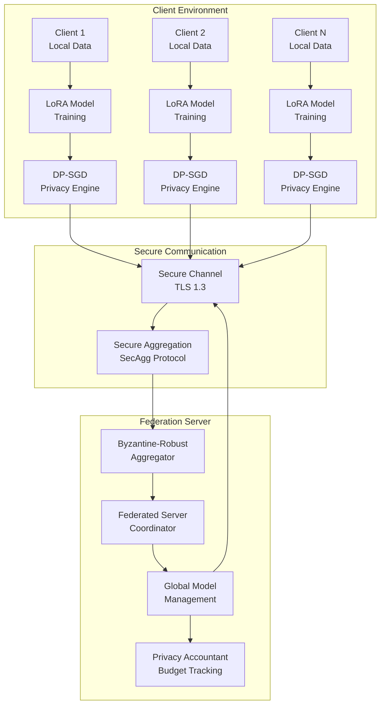
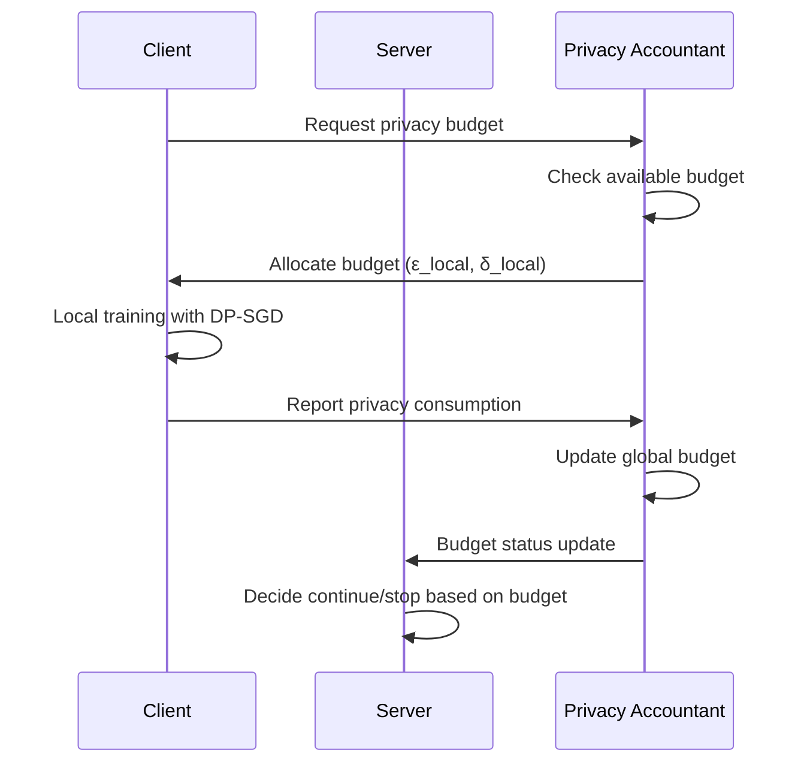
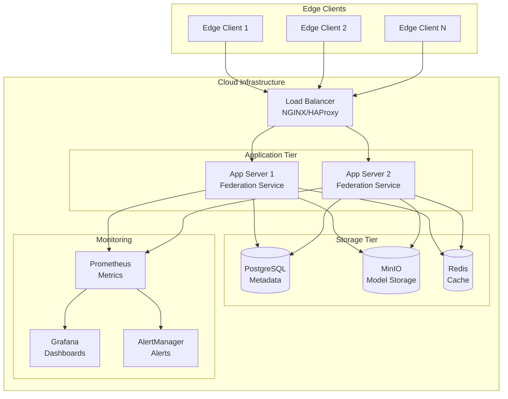

# Architecture Documentation

## System Overview

**dp-federated-lora-lab** implements a distributed privacy-preserving machine learning system combining Federated Learning with Differential Privacy for Large Language Model fine-tuning using Low-Rank Adaptation (LoRA).

## High-Level Architecture



## Component Architecture

### 1. Client-Side Components

#### LoRA Adapter Module
- **Purpose**: Low-rank adaptation for efficient fine-tuning
- **Implementation**: Built on HuggingFace PEFT
- **Configuration**: Adaptive rank selection based on data characteristics
- **Key Features**:
  - Rank optimization (4-64 dimensions)
  - Target module selection (attention layers)
  - Memory-efficient training

#### Differential Privacy Engine
- **Purpose**: Add calibrated noise to gradients
- **Implementation**: PyTorch Opacus integration
- **Mechanisms**: Gaussian noise injection
- **Key Features**:
  - RDP (Rényi Differential Privacy) accounting
  - Adaptive clipping
  - Per-sample gradient computation

#### Local Training Coordinator
- **Purpose**: Orchestrate local training rounds
- **Responsibilities**:
  - Data loading and preprocessing
  - Model initialization and updates
  - Privacy budget management
  - Communication with federation server

### 2. Server-Side Components

#### Federation Coordinator
- **Purpose**: Manage federated learning process
- **Responsibilities**:
  - Client registration and selection
  - Round coordination
  - Global model state management
  - Result aggregation

#### Secure Aggregation Service
- **Purpose**: Privacy-preserving aggregation of client updates
- **Protocols Supported**:
  - SecAgg (Secure Aggregation)
  - Homomorphic encryption-based
  - Multi-party computation (MPC)

#### Byzantine-Robust Aggregator
- **Purpose**: Detect and filter malicious client updates
- **Methods**:
  - Krum algorithm
  - Trimmed mean
  - Coordinate-wise median
  - Similarity-based detection

#### Privacy Accountant
- **Purpose**: Track cumulative privacy expenditure
- **Features**:
  - RDP composition theorems
  - Optimal privacy analysis
  - Per-client budget tracking
  - Global budget management

### 3. Communication Layer

#### Secure Transport
- **Protocol**: TLS 1.3 with mutual authentication
- **Certificates**: Client certificates for authentication
- **Encryption**: End-to-end encryption for model updates

#### Message Protocol
- **Format**: Protocol Buffers for efficient serialization
- **Compression**: gRPC compression for bandwidth efficiency
- **Reliability**: Automatic retry with exponential backoff

## Security Architecture

### Threat Model

#### Assumptions
- **Honest-but-curious server**: Server follows protocol but may try to infer private information
- **Malicious clients**: Up to 20% of clients may be Byzantine
- **Network adversary**: Passive eavesdropping on communication channels
- **Differential privacy**: Formal privacy guarantees against arbitrary auxiliary information

#### Security Guarantees
- **Differential Privacy**: (ε, δ)-DP with ε ≤ 10, δ ≤ 10^-5
- **Secure Aggregation**: Server cannot see individual client updates
- **Byzantine Resilience**: Up to f < n/3 malicious clients tolerated
- **Communication Security**: TLS 1.3 with perfect forward secrecy

### Privacy Mechanisms

#### Gradient Clipping
```python
def clip_gradients(gradients, max_norm=1.0):
    """Clip gradients to bound sensitivity."""
    total_norm = torch.norm(torch.stack([torch.norm(g) for g in gradients]))
    clip_factor = min(1.0, max_norm / total_norm)
    return [g * clip_factor for g in gradients]
```

#### Noise Addition
```python
def add_gaussian_noise(gradients, noise_multiplier, sensitivity):
    """Add calibrated Gaussian noise for DP."""
    sigma = noise_multiplier * sensitivity
    return [g + torch.normal(0, sigma, g.shape) for g in gradients]
```

## Data Flow

### Training Round Execution

1. **Client Selection**: Server selects subset of available clients
2. **Model Distribution**: Global model broadcast to selected clients
3. **Local Training**: Clients train LoRA adapters with DP-SGD
4. **Secure Upload**: Encrypted model updates sent to server
5. **Aggregation**: Byzantine-robust secure aggregation
6. **Global Update**: Updated global model parameters
7. **Privacy Accounting**: Budget consumption tracking

### Privacy Budget Flow



## Scalability Considerations

### Horizontal Scaling
- **Client Capacity**: Supports 1000+ concurrent clients
- **Server Clustering**: Distributed server deployment
- **Load Balancing**: Intelligent client assignment
- **Database Sharding**: Distributed model storage

### Performance Optimizations
- **Gradient Compression**: Quantization and sparsification
- **Adaptive Communication**: Frequency-based updates
- **Caching**: Model checkpoint caching
- **Batching**: Batch aggregation for efficiency

## Deployment Architecture

### Production Deployment



### Container Architecture

```dockerfile
# Multi-stage build for optimization
FROM pytorch/pytorch:2.0.0-cuda11.8-cudnn8-devel AS builder
WORKDIR /build
COPY requirements.txt .
RUN pip install --no-cache-dir -r requirements.txt

FROM pytorch/pytorch:2.0.0-cuda11.8-cudnn8-runtime
WORKDIR /app
COPY --from=builder /opt/conda /opt/conda
COPY . .
EXPOSE 8080 8443
CMD ["python", "src/dp_federated_lora/server.py"]
```

## Quality Attributes

### Performance
- **Latency**: < 100ms per aggregation round
- **Throughput**: > 1000 clients per round
- **Scalability**: Linear scaling with server resources

### Reliability
- **Availability**: 99.9% uptime SLA
- **Fault Tolerance**: Graceful handling of client failures
- **Recovery**: Automatic checkpoint recovery

### Security
- **Privacy**: Formal DP guarantees
- **Authentication**: Mutual TLS authentication
- **Authorization**: Role-based access control
- **Audit**: Comprehensive security logging

### Maintainability
- **Modularity**: Clear separation of concerns
- **Testability**: >90% code coverage
- **Documentation**: Comprehensive API documentation
- **Monitoring**: Full observability stack

## Technology Stack

### Core Technologies
- **Language**: Python 3.9+
- **ML Framework**: PyTorch 2.0+
- **FL Framework**: Custom (inspired by Flower)
- **DP Library**: Opacus 1.4+
- **Communication**: gRPC + Protocol Buffers

### Infrastructure
- **Containerization**: Docker + Kubernetes
- **Service Mesh**: Istio (optional)
- **Database**: PostgreSQL 15+
- **Cache**: Redis 7+
- **Storage**: MinIO (S3-compatible)

### Monitoring & Observability
- **Metrics**: Prometheus + Grafana
- **Logging**: ELK Stack (Elasticsearch, Logstash, Kibana)
- **Tracing**: Jaeger (OpenTelemetry)
- **Alerting**: AlertManager + PagerDuty

## Integration Points

### External Systems
- **Model Repositories**: HuggingFace Hub integration
- **Experiment Tracking**: Weights & Biases integration
- **CI/CD**: GitHub Actions workflows
- **Monitoring**: Prometheus/Grafana stack

### API Interfaces
- **REST API**: Client management and monitoring
- **gRPC API**: High-performance training communication
- **WebSocket**: Real-time dashboard updates
- **GraphQL**: Flexible query interface (optional)

## Evolution and Extensibility

### Planned Enhancements
- **Cross-silo Federation**: Multi-organization support
- **Personalized DP**: Client-specific privacy levels
- **Federated Analytics**: Privacy-preserving evaluation
- **Advanced Aggregation**: FedProx, FedNova algorithms

### Extension Points
- **Aggregation Plugins**: Custom aggregation algorithms
- **Privacy Mechanisms**: Additional DP mechanisms
- **Model Architectures**: Support for new model types
- **Communication Protocols**: Alternative transport layers