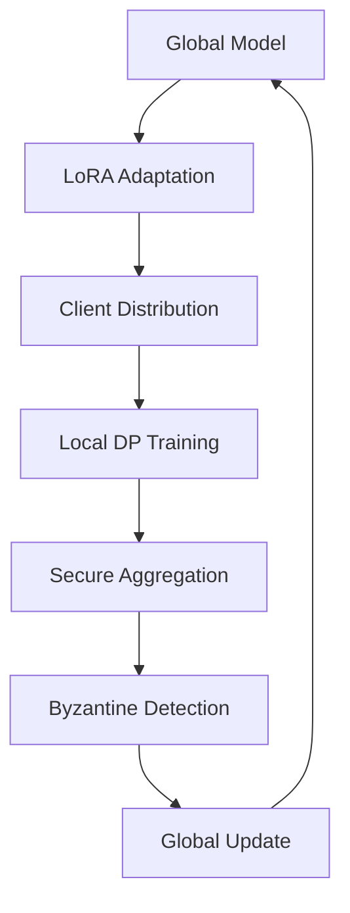

# Development Guide

This guide covers the development setup, architecture, and best practices for contributing to DP-Federated LoRA Lab.

## 🚀 Quick Development Setup

```bash
# 1. Clone and navigate
git clone https://github.com/yourusername/dp-federated-lora-lab.git
cd dp-federated-lora-lab

# 2. Create virtual environment
python -m venv venv
source venv/bin/activate  # or venv\Scripts\activate on Windows

# 3. Install in development mode
make install-dev

# 4. Verify installation
make test-fast
```

## 📁 Project Structure

```
dp-federated-lora-lab/
├── src/dp_federated_lora/       # Main package
│   ├── __init__.py              # Package initialization
│   ├── client.py                # Federated client implementation
│   ├── server.py                # Federated server implementation
│   ├── aggregation/             # Aggregation protocols
│   ├── privacy/                 # Differential privacy mechanisms
│   ├── monitoring/              # Tracking and visualization
│   └── utils/                   # Utility functions
├── tests/                       # Test suite
│   ├── unit/                    # Unit tests
│   ├── integration/             # Integration tests
│   └── privacy/                 # Privacy-specific tests
├── docs/                        # Documentation
├── examples/                    # Usage examples
├── benchmarks/                  # Performance benchmarks
├── requirements.txt             # Production dependencies
├── requirements-dev.txt         # Development dependencies
└── pyproject.toml              # Project configuration
```

## 🧪 Testing Strategy

### Test Categories

```bash
# Unit tests (fast, isolated)
pytest tests/unit/

# Integration tests (slower, end-to-end)
pytest tests/integration/

# Privacy tests (verify DP guarantees)
pytest -m privacy

# GPU tests (require CUDA)
pytest -m gpu --rungpu

# All tests with coverage
make test-cov
```

### Writing Tests

```python
import pytest
from dp_federated_lora import DPLoRAClient

class TestDPLoRAClient:
    def test_client_initialization(self, lora_config, privacy_config):
        """Test basic client initialization."""
        client = DPLoRAClient(
            client_id="test_client",
            lora_config=lora_config,
            privacy_config=privacy_config
        )
        assert client.client_id == "test_client"
    
    @pytest.mark.privacy
    def test_privacy_guarantee(self, client, sample_data):
        """Test that privacy guarantees are maintained."""
        epsilon_before = client.privacy_engine.get_epsilon()
        client.train_local(sample_data)
        epsilon_after = client.privacy_engine.get_epsilon()
        
        assert epsilon_after > epsilon_before
        assert epsilon_after <= client.privacy_config.max_epsilon
```

## 🔒 Privacy Testing

Privacy tests are critical for this project:

```python
@pytest.mark.privacy
class TestPrivacyGuarantees:
    def test_epsilon_delta_bounds(self, privacy_engine):
        """Verify (ε, δ)-DP bounds are maintained."""
        # Run privacy-consuming operation
        privacy_engine.add_noise(sensitivity=1.0)
        
        # Check bounds
        epsilon = privacy_engine.get_epsilon(delta=1e-5)
        assert epsilon <= privacy_engine.max_epsilon
    
    def test_composition_theorem(self, privacy_engine):
        """Verify privacy composition is correct."""
        # Multiple operations
        for _ in range(10):
            privacy_engine.add_noise(sensitivity=1.0)
        
        # Advanced composition should be tighter than basic
        basic_epsilon = 10 * privacy_engine.base_epsilon
        advanced_epsilon = privacy_engine.get_epsilon_advanced_composition()
        assert advanced_epsilon < basic_epsilon
```

## 🏗️ Architecture Overview

### Core Components

1. **FederatedServer**: Orchestrates training across clients
2. **DPLoRAClient**: Handles local training with privacy
3. **PrivacyEngine**: Implements DP mechanisms
4. **SecureAggregator**: Secure multi-party aggregation
5. **UtilityMonitor**: Privacy-utility tracking

### Data Flow



### Privacy Architecture

```python
class PrivacyEngine:
    """Core privacy mechanism implementation."""
    
    def __init__(self, noise_multiplier: float, max_grad_norm: float):
        self.noise_multiplier = noise_multiplier
        self.max_grad_norm = max_grad_norm
        self.accountant = PrivacyAccountant()
    
    def privatize_gradients(self, gradients: List[torch.Tensor]) -> List[torch.Tensor]:
        """Add calibrated noise to gradients."""
        # Clip gradients
        clipped_grads = self.clip_gradients(gradients)
        
        # Add Gaussian noise
        noisy_grads = self.add_noise(clipped_grads)
        
        # Update privacy accounting
        self.accountant.step()
        
        return noisy_grads
```

## 🔧 Development Workflow

### 1. Branch Strategy
```bash
# Feature branches
git checkout -b feature/privacy-amplification

# Bug fixes
git checkout -b fix/gradient-clipping-bug

# Documentation
git checkout -b docs/api-reference
```

### 2. Code Quality Pipeline
```bash
# Format code
make format

# Run linting
make lint

# Type checking
make type-check

# Security scan
make security

# Full quality check
make check-all
```

### 3. Pre-commit Setup
```bash
# Install hooks
pre-commit install

# Run on all files
pre-commit run --all-files

# Update hooks
pre-commit autoupdate
```

## 📊 Performance Profiling

### CPU Profiling
```python
import cProfile
import pstats

# Profile training
profiler = cProfile.Profile()
profiler.enable()

# Run training code
client.train_local(dataset)

profiler.disable()
stats = pstats.Stats(profiler)
stats.sort_stats('cumulative').print_stats(20)
```

### Memory Profiling
```python
from memory_profiler import profile

@profile
def train_with_privacy():
    """Profile memory usage during training."""
    client = DPLoRAClient(...)
    client.train_local(large_dataset)
```

### GPU Profiling
```python
import torch.profiler

with torch.profiler.profile(
    activities=[
        torch.profiler.ProfilerActivity.CPU,
        torch.profiler.ProfilerActivity.CUDA,
    ],
    schedule=torch.profiler.schedule(wait=1, warmup=1, active=3),
    on_trace_ready=torch.profiler.tensorboard_trace_handler('./log/profiler'),
    record_shapes=True,
    with_stack=True,
) as prof:
    for step, batch in enumerate(dataloader):
        if step >= (1 + 1 + 3) * 2:
            break
        train_step(batch)
        prof.step()
```

## 🐛 Debugging

### Privacy Debugging
```python
# Enable debug mode for privacy accounting
privacy_engine = PrivacyEngine(debug=True)

# Log privacy parameters
import logging
logging.basicConfig(level=logging.DEBUG)
logger = logging.getLogger('dp_federated_lora.privacy')

logger.debug(f"Current epsilon: {privacy_engine.get_epsilon()}")
logger.debug(f"Noise multiplier: {privacy_engine.noise_multiplier}")
```

### Federated Debugging
```python
# Mock client for debugging
class DebugClient(DPLoRAClient):
    def train_local(self, dataset):
        print(f"Client {self.client_id} training on {len(dataset)} samples")
        result = super().train_local(dataset)
        print(f"Client {self.client_id} completed training")
        return result

# Enable server debugging
server = FederatedServer(debug=True)
server.set_log_level('DEBUG')
```

## 📈 Benchmarking

### Standard Benchmarks
```python
from dp_federated_lora.benchmarks import StandardBenchmark

benchmark = StandardBenchmark()
results = benchmark.run_privacy_utility_curve(
    epsilon_values=[1.0, 2.0, 4.0, 8.0],
    model_name="llama-7b",
    dataset="shakespeare"
)

benchmark.plot_results(results, save_path="benchmark_results.png")
```

### Custom Benchmarks
```python
class CustomBenchmark:
    def benchmark_aggregation_time(self, num_clients: int):
        """Benchmark secure aggregation performance."""
        start_time = time.time()
        
        # Create clients and run aggregation
        clients = [create_client(i) for i in range(num_clients)]
        aggregator = SecureAggregator()
        result = aggregator.aggregate([c.get_update() for c in clients])
        
        end_time = time.time()
        return end_time - start_time
```

## 🔐 Security Considerations

### Secure Development Practices

1. **Input Validation**
   ```python
   def validate_privacy_params(epsilon: float, delta: float):
       if epsilon <= 0:
           raise ValueError("Epsilon must be positive")
       if not 0 < delta < 1:
           raise ValueError("Delta must be in (0, 1)")
   ```

2. **Secure Random Generation**
   ```python
   import secrets
   import torch
   
   # Use cryptographically secure random numbers
   secure_generator = torch.Generator()
   secure_generator.manual_seed(secrets.randbits(64))
   ```

3. **Memory Safety**
   ```python
   def secure_delete(tensor: torch.Tensor):
       """Securely overwrite tensor memory."""
       if tensor.is_cuda:
           tensor.zero_()
           torch.cuda.synchronize()
       else:
           tensor.zero_()
   ```

### Vulnerability Testing
```python
class SecurityTests:
    @pytest.mark.security
    def test_gradient_inversion_resistance(self):
        """Test resistance to gradient inversion attacks."""
        # Attempt gradient inversion
        recovered_data = attempt_gradient_inversion(client_gradients)
        
        # Verify data is not recoverable
        similarity = compute_similarity(original_data, recovered_data)
        assert similarity < 0.1  # Should be random-like

    @pytest.mark.security  
    def test_membership_inference_resistance(self):
        """Test resistance to membership inference attacks."""
        # Train model and attempt membership inference
        attack_accuracy = run_membership_inference_attack(model, dataset)
        
        # Should be close to random guessing (50%)
        assert abs(attack_accuracy - 0.5) < 0.1
```

## 📝 Documentation

### Code Documentation
```python
def train_with_dp(
    model: torch.nn.Module,
    dataloader: torch.utils.data.DataLoader,
    privacy_engine: PrivacyEngine,
    epochs: int = 10
) -> TrainingHistory:
    """
    Train model with differential privacy.
    
    Args:
        model: PyTorch model to train
        dataloader: Training data loader
        privacy_engine: Configured privacy engine
        epochs: Number of training epochs
        
    Returns:
        TrainingHistory containing loss, accuracy, and privacy metrics
        
    Raises:
        PrivacyBudgetExceededError: If privacy budget is exhausted
        
    Example:
        >>> privacy_engine = PrivacyEngine(noise_multiplier=1.1)
        >>> history = train_with_dp(model, dataloader, privacy_engine)
        >>> print(f"Final epsilon: {history.final_epsilon}")
    """
```

### API Documentation
```bash
# Build documentation
make docs

# Serve locally
make serve-docs

# Check documentation coverage
sphinx-build -b coverage docs/ docs/_build/coverage
```

## 🚀 Deployment

### Development Environment
```dockerfile
FROM pytorch/pytorch:2.0.0-cuda11.8-cudnn8-devel

WORKDIR /app
COPY requirements-dev.txt .
RUN pip install -r requirements-dev.txt

COPY . .
RUN pip install -e ".[dev]"

CMD ["pytest"]
```

### Production Environment
```dockerfile
FROM pytorch/pytorch:2.0.0-cuda11.8-cudnn8-runtime

WORKDIR /app
COPY requirements.txt .
RUN pip install -r requirements.txt

COPY src/ src/
RUN pip install .

EXPOSE 8080
CMD ["python", "-m", "dp_federated_lora.server"]
```

## 🤝 Contributing Guidelines

1. **Create an issue** before starting work
2. **Follow coding standards** (black, isort, type hints)
3. **Write comprehensive tests** including privacy tests
4. **Update documentation** for API changes
5. **Run security checks** before submitting
6. **Keep PRs focused** and atomic

## 📞 Getting Help

- **GitHub Issues**: Bug reports and feature requests
- **GitHub Discussions**: Questions and community help
- **Security Issues**: security@terragonlabs.com
- **Maintainer**: @danielschmidt

Happy coding! 🛡️🤖