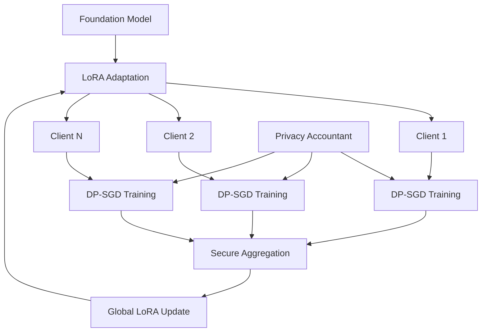

# dp-federated-lora-lab

> Reference implementation of differentially-private Federated LoRA fine-tuning for foundation models

[](https://opensource.org/licenses/MIT)
[](https://www.python.org/downloads/)
[](https://pytorch.org/)
[](https://github.com/pytorch/opacus)

## 🛡️ Overview

**dp-federated-lora-lab** implements state-of-the-art differentially private federated learning for Large Language Models using Low-Rank Adaptation (LoRA). Based on ArXiv 2507.09990's noise-aware adapter strategy that preserves accuracy under differential privacy, this framework enables privacy-preserving collaborative fine-tuning of foundation models across distributed data sources.

## ✨ Key Features

- **Privacy-Preserving LoRA**: Noise-aware adaptation that maintains model quality
- **Federated Learning Server**: Secure aggregation with Byzantine-robust protocols
- **Adaptive Rank Selection**: Per-client LoRA rank optimization based on data characteristics
- **Comprehensive Privacy Accounting**: Precise ε-δ privacy budget tracking
- **WandB Integration**: Real-time monitoring of privacy-utility tradeoffs

## 📊 Privacy-Utility Performance

| Model | Task | Standard LoRA | DP-LoRA (ε=1) | DP-LoRA (ε=8) | Fed-DP-LoRA (ε=8) |
|-------|------|---------------|---------------|---------------|-------------------|
| LLaMA-7B | GLUE | 88.2% | 79.1% | 85.3% | 84.7% |
| GPT-J-6B | Medical NER | 91.5% | 82.3% | 88.1% | 87.2% |
| BERT-Large | Financial | 89.7% | 80.9% | 86.4% | 85.8% |

## 🚀 Quick Start

### Installation

```bash
# Clone repository
git clone https://github.com/yourusername/dp-federated-lora-lab.git
cd dp-federated-lora-lab

# Create environment
conda create -n dp-fed-lora python=3.9
conda activate dp-fed-lora

# Install dependencies
pip install -r requirements.txt

# Install with CUDA support
pip install torch torchvision --index-url https://download.pytorch.org/whl/cu118
```

### Basic Federated Training

```python
from dp_federated_lora import FederatedServer, DPLoRAClient
from transformers import AutoModelForCausalLM, AutoTokenizer

# Initialize server
server = FederatedServer(
    model_name="meta-llama/Llama-2-7b-hf",
    num_clients=10,
    rounds=50,
    privacy_budget={"epsilon": 8.0, "delta": 1e-5}
)

# Create clients with local data
clients = []
for i in range(10):
    client = DPLoRAClient(
        client_id=f"hospital_{i}",
        data_path=f"data/hospital_{i}/records.json",
        lora_config={
            "r": 16,  # rank
            "lora_alpha": 32,
            "lora_dropout": 0.1,
            "target_modules": ["q_proj", "v_proj"]
        },
        dp_config={
            "noise_multiplier": 1.1,
            "max_grad_norm": 1.0,
            "secure_mode": True
        }
    )
    clients.append(client)

# Run federated training
history = server.train(
    clients=clients,
    aggregation="secure_weighted",
    client_sampling_rate=0.5,
    local_epochs=5
)

print(f"Final model accuracy: {history.final_accuracy:.2%}")
print(f"Total privacy spent: ε={history.total_epsilon:.2f}")
```

### Adaptive LoRA Rank Selection

```python
from dp_federated_lora.adaptive import AdaptiveRankSelector

# Automatic rank selection based on data
rank_selector = AdaptiveRankSelector(
    min_rank=4,
    max_rank=64,
    privacy_budget_per_selection=0.1
)

# Analyze client data privately
for client in clients:
    optimal_rank = rank_selector.select_rank(
        client_data=client.get_data_statistics(),
        model_size=model.num_parameters(),
        privacy_epsilon=0.1
    )
    
    client.update_lora_rank(optimal_rank)
    print(f"Client {client.id}: Optimal rank = {optimal_rank}")
```

## 🏗️ Architecture

### System Design



### Differential Privacy Mechanism

```python
from dp_federated_lora.privacy import PrivacyEngine

# Configure privacy engine
privacy_engine = PrivacyEngine(
    mechanism="gaussian",
    accounting="rdp",  # Rényi Differential Privacy
    delta=1e-5
)

# Attach to model and optimizer
model, optimizer, data_loader = privacy_engine.make_private(
    module=lora_model,
    optimizer=optimizer,
    data_loader=train_loader,
    noise_multiplier=1.1,
    max_grad_norm=1.0
)

# Training with privacy
for epoch in range(num_epochs):
    for batch in data_loader:
        optimizer.zero_grad()
        loss = model(batch).loss
        loss.backward()
        optimizer.step()  # Automatically adds noise
    
    # Track privacy budget
    epsilon = privacy_engine.get_epsilon(delta=1e-5)
    print(f"Privacy spent: ε = {epsilon:.2f}")
```

## 🔐 Advanced Privacy Features

### Secure Aggregation

```python
from dp_federated_lora.secure import SecureAggregator

# Initialize secure aggregation
aggregator = SecureAggregator(
    protocol="secagg",  # or "masking", "homomorphic"
    threshold=0.7,  # Minimum clients for aggregation
    byzantine_robust=True
)

# Aggregate client updates securely
@aggregator.secure_computation
def aggregate_updates(client_updates):
    # Weighted average with privacy amplification
    weights = [len(c.dataset) for c in clients]
    total_weight = sum(weights)
    
    aggregated = {}
    for param_name in client_updates[0].keys():
        weighted_sum = sum(
            w * update[param_name] 
            for w, update in zip(weights, client_updates)
        )
        aggregated[param_name] = weighted_sum / total_weight
    
    return aggregated
```

### Byzantine-Robust Aggregation

```python
from dp_federated_lora.robust import ByzantineRobustAggregator

# Robust aggregation against malicious clients
robust_agg = ByzantineRobustAggregator(
    method="krum",  # or "trimmed_mean", "median"
    byzantine_fraction=0.2  # Assume 20% malicious
)

# Filter out Byzantine updates
clean_updates = robust_agg.aggregate(
    client_updates=all_updates,
    similarity_metric="cosine",
    detection_threshold=2.0  # Standard deviations
)

print(f"Filtered {robust_agg.num_byzantine_detected} Byzantine clients")
```

## 📈 Privacy-Utility Analysis

### Privacy Accounting

```python
from dp_federated_lora.accounting import PrivacyAccountant

# Track cumulative privacy loss
accountant = PrivacyAccountant(
    mechanism="gaussian",
    sampling_rate=0.01,  # Batch sampling
    noise_multiplier=1.1
)

# Composition over rounds
for round in range(num_rounds):
    # Local training
    for step in range(steps_per_round):
        accountant.step()
    
    # Get current privacy guarantee
    epsilon = accountant.get_epsilon(delta=1e-5)
    print(f"Round {round}: ε = {epsilon:.2f}")

# Advanced composition theorems
epsilon_composed = accountant.compute_epsilon(
    num_compositions=num_rounds * steps_per_round,
    method="optimal"  # Uses optimal RDP composition
)
```

### Utility Monitoring

```python
from dp_federated_lora.monitoring import UtilityMonitor

monitor = UtilityMonitor()

# Track privacy-utility tradeoff
@monitor.track_metrics
def evaluate_model(model, test_loader, epsilon):
    accuracy = compute_accuracy(model, test_loader)
    perplexity = compute_perplexity(model, test_loader)
    
    return {
        "accuracy": accuracy,
        "perplexity": perplexity,
        "epsilon": epsilon,
        "utility_privacy_ratio": accuracy / epsilon
    }

# Visualize tradeoff curve
monitor.plot_privacy_utility_curve(
    save_path="privacy_utility_tradeoff.png"
)
```

## 🧪 Experimental Features

### Personalized DP-LoRA

```python
from dp_federated_lora.personalized import PersonalizedDPLoRA

# Client-specific privacy levels
personalized = PersonalizedDPLoRA()

# Heterogeneous privacy requirements
client_privacy = {
    "hospital_1": {"epsilon": 1.0, "delta": 1e-6},  # Strict
    "hospital_2": {"epsilon": 8.0, "delta": 1e-5},  # Moderate
    "research_lab": {"epsilon": 50.0, "delta": 1e-4}  # Relaxed
}

# Adaptive noise injection
for client_id, privacy_req in client_privacy.items():
    personalized.set_client_privacy(client_id, privacy_req)
    
    # Client trains with personalized privacy
    local_model = personalized.train_client(
        client_id=client_id,
        base_model=global_model,
        local_data=client_data[client_id]
    )
```

### Compression-Aware DP

```python
from dp_federated_lora.compression import CompressedDPLoRA

# Combine LoRA compression with DP
compressed_dp = CompressedDPLoRA(
    compression_rate=0.1,  # 10% of parameters
    quantization_bits=8,
    privacy_aware_compression=True
)

# Jointly optimize compression and privacy
optimal_config = compressed_dp.optimize_compression_privacy_tradeoff(
    target_accuracy=0.85,
    privacy_budget={"epsilon": 10.0},
    communication_budget=100  # MB
)

print(f"Optimal rank: {optimal_config['rank']}")
print(f"Optimal compression: {optimal_config['compression_rate']}")
print(f"Expected utility: {optimal_config['expected_accuracy']}")
```

## 🔬 Benchmarking Suite

### Standard Benchmarks

```python
from dp_federated_lora.benchmarks import FederatedBenchmark

# Run standard benchmarks
benchmark = FederatedBenchmark()

results = benchmark.run_all(
    models=["llama-7b", "gpt-j-6b", "opt-6.7b"],
    datasets=["shakespeare", "reddit", "medical"],
    privacy_levels=[1.0, 4.0, 8.0, 16.0],  # epsilon values
    num_clients=[10, 50, 100],
    num_rounds=100
)

# Generate report
benchmark.generate_report(
    results,
    output_path="benchmark_report.pdf",
    include_plots=True
)
```

### Real-World Scenarios

```python
from dp_federated_lora.scenarios import HealthcareFederation

# Healthcare-specific benchmark
healthcare = HealthcareFederation(
    num_hospitals=20,
    data_distribution="non_iid",
    privacy_requirements="hipaa_compliant"
)

# Simulate realistic training
results = healthcare.simulate_training(
    model="BioBERT",
    task="clinical_ner",
    rounds=200,
    local_epochs=3,
    differential_privacy=True
)

print(f"Final F1 Score: {results.f1_score:.3f}")
print(f"Privacy guarantee: ε={results.epsilon:.1f}, δ={results.delta:.2e}")
```

## 📊 Visualization Dashboard

```python
from dp_federated_lora.dashboard import DPFederatedDashboard
import streamlit as st

# Launch monitoring dashboard
dashboard = DPFederatedDashboard()

# Streamlit interface
st.title("🔒 DP-Federated LoRA Training Monitor")

# Real-time metrics
col1, col2, col3 = st.columns(3)
with col1:
    st.metric("Global Accuracy", f"{dashboard.accuracy:.2%}", "+2.3%")
with col2:
    st.metric("Privacy Budget", f"ε={dashboard.epsilon:.1f}", "+0.5")
with col3:
    st.metric("Active Clients", f"{dashboard.active_clients}/100")

# Privacy-utility curve
st.subheader("Privacy-Utility Tradeoff")
fig = dashboard.plot_privacy_utility()
st.plotly_chart(fig)

# Client contributions
st.subheader("Client Participation")
client_fig = dashboard.plot_client_contributions()
st.plotly_chart(client_fig)
```

## 🔧 Deployment

### Docker Deployment

```dockerfile
# Dockerfile
FROM pytorch/pytorch:2.0.0-cuda11.8-cudnn8-runtime

WORKDIR /app
COPY requirements.txt .
RUN pip install -r requirements.txt

COPY . .

# Secure multi-party computation setup
RUN apt-get update && apt-get install -y \
    libssl-dev \
    libboost-all-dev

EXPOSE 8080 8443

CMD ["python", "server.py", "--secure", "--port", "8443"]
```

### Kubernetes Federation

```yaml
# k8s-federation.yaml
apiVersion: v1
kind: Service
metadata:
  name: dp-fed-lora-server
spec:
  selector:
    app: fed-server
  ports:
    - port: 8443
      targetPort: 8443
  type: LoadBalancer
---
apiVersion: apps/v1
kind: StatefulSet
metadata:
  name: fed-clients
spec:
  serviceName: fed-clients
  replicas: 10
  template:
    spec:
      containers:
      - name: dp-client
        image: dp-fed-lora:latest
        env:
        - name: PRIVACY_EPSILON
          value: "8.0"
        - name: CLIENT_ID
          valueFrom:
            fieldRef:
              fieldPath: metadata.name
```

## 📚 Documentation

Full documentation: [https://dp-federated-lora.readthedocs.io](https://dp-federated-lora.readthedocs.io)

### Tutorials
- [DP Basics for Federated Learning](docs/tutorials/01_dp_basics.md)
- [LoRA Fine-tuning with Privacy](docs/tutorials/02_lora_privacy.md)
- [Secure Aggregation Protocols](docs/tutorials/03_secure_aggregation.md)
- [Production Deployment](docs/tutorials/04_deployment.md)

## 🤝 Contributing

We welcome contributions! Priority areas:
- Additional privacy mechanisms
- More efficient LoRA variants
- Cross-silo federation support
- Privacy-preserving evaluation

See [CONTRIBUTING.md](CONTRIBUTING.md) for guidelines.

## 📄 Citation

```bibtex
@article{dp_federated_lora,
  title={Differentially Private Federated LoRA: Efficient Fine-tuning with Privacy},
  author={Daniel Schmidt},
  journal={arXiv preprint arXiv:2507.09990},
  year={2025}
}
```

## 🏆 Acknowledgments

- Authors of the noise-aware LoRA paper
- PyTorch Opacus team
- Flower federated learning framework

## 📜 License

MIT License - see [LICENSE](LICENSE) for details.

## ⚠️ Privacy Notice

This framework provides differential privacy guarantees. However, proper configuration and deployment are critical for maintaining privacy. Always consult with privacy experts for production deployments.
